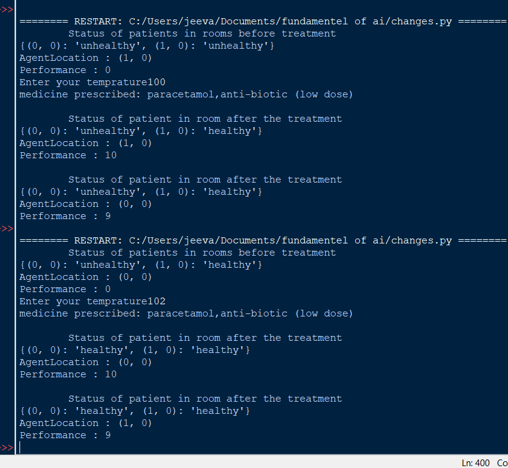
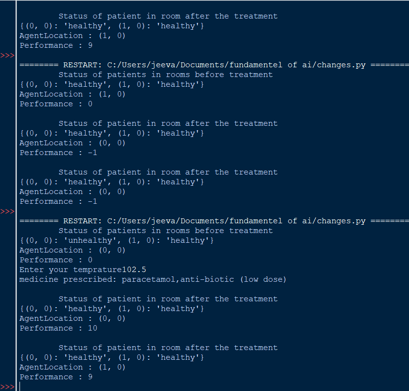

# Developing AI Agent with PEAS Description

## AIM

To find the PEAS description for the given AI problem and develop an AI agent.

## THEORY
### Medicine prescribing agent:
Such as this agent prescribe medicine for fever (greater than 98.5 degree) which we consider here as unhealthy, by the user temperature input and another environment is rooms in the hospital (two rooms).
This agent has to consider two factors one is room location and unhealthy patient in random room , the agent has to move from one room to another to check and treat unhealthy person.
Performance of the agent is calculated by incrementing performance and each time after treating in one room again it has to check another room so that the movement cause the agent to reduce its performance.
Hence,agent prescribe medicine to unhealthy.

## PEAS DESCRIPTION

Agent Type  | Performance | Environment | Actuators | Sensors |
------------- | ------------- | ------------- | ------------- | -------------- |
 | Medicine prescribing agent | Treating unhealthy , agent movement | Rooms , Patient | Medicine , Treatment| Location , Temperature of patient |


## DESIGN STEPS
### STEP 1:
#### Identifying the input:
Temperature from patients , Location.

### STEP 2:
#### Identifying the output: 
Prescribe medicine if patient in a random has fever.

### STEP 3:
#### Developing the PEAS description:
PEAS description developed by the performance, environment, actuators and sensors in agent.
### STEP 4:
#### Implementing the AI agent:
Treat unhealthy patient in each room. And check for unhealthy patient in random room

### STEP 5:
Measure the performance parameters:
For each treatment performance incremented,for each movement performance decremented

## PROGRAM
```


```

## OUTPUT




## RESULT
Thus , AI agent was developed and PEAS description drawn.

